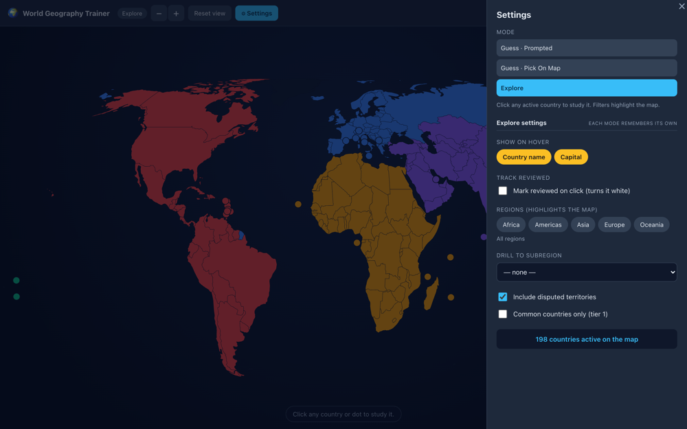
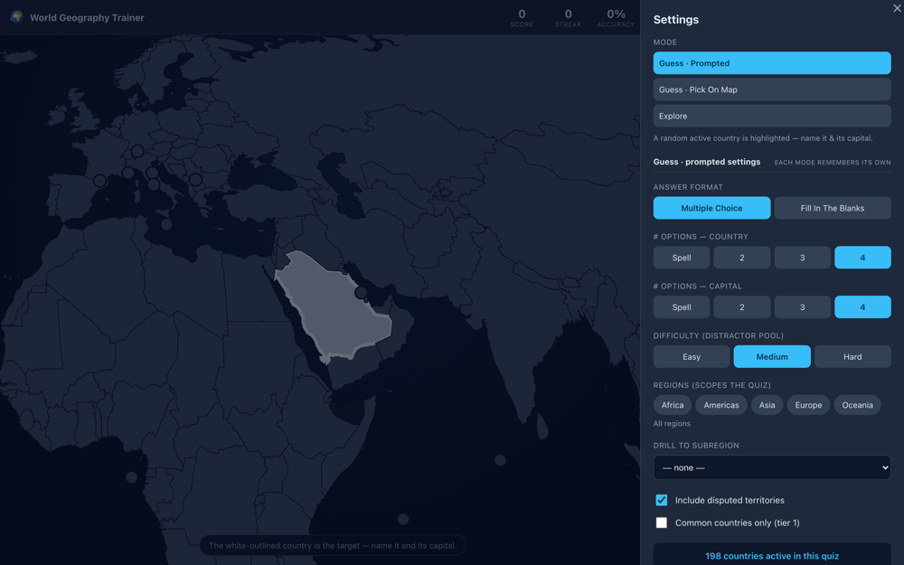

# World Geography Trainer — Gameplay & UX Review

**Date:** 2026-06-20
**Method:** Read the codebase, then drove the running app with headless Chrome
(puppeteer-core) and captured every key state across desktop + mobile. Screenshots
referenced below live in [`./screenshots/`](./screenshots/) (review artifacts — not bundled).

This is a findings + recommendations doc for scoping. Each item has an **Impact**
(High / Medium / Low) and a rough **Effort** (S / M / L). Nothing here is implemented yet.

---

## TL;DR — recommended first cut

> **✅ Update 2026-06-20 — EVERYTHING in this doc is now implemented and verified.** The
> six "first cut" rows below shipped first; the full second cut (all remaining A/B/C items
> plus a few nice-to-haves) followed. Build passes; each item verified with headless-Chrome
> screenshots in [`./screenshots/after/`](./screenshots/after/). Every finding is ticked ✅
> with a **Done** note and before/after shots inline. See the **Status** section at the
> bottom for the full list. Nothing has been committed/pushed yet — ready for your review.

If we only ship a handful, these give the most UX per unit of work:

| # | Fix | Impact | Effort | Area | Status |
|---|-----|--------|--------|------|--------|
| C1 | Pick mode spoils its own answer — panel showed "Capital of **Poland**" before you'd named it | **High** | **S** | Gameplay | ✅ Done |
| B1+B2 | Selection/target was invisible at world zoom, and the amber highlight collided with the Africa region colour | **High** | M | Map states | ✅ Done |
| B3+B4 | "White" meant 3 different things; "reviewed" was unreadable at the zoom you actually use it at | **High** | M | Map states (reviewed) | ✅ Done |
| A1 | Mode switching was buried in Settings (the top-bar mode label was not clickable) | **High** | M | Settings / nav | ✅ Done |
| C7 | Mobile map was letterboxed into ~half its column; tiny tap targets | **High** | M | Mobile | ✅ Done |
| C2 | Prompted mode: the capital options leaked the country ("Mexico City" → it's Mexico) | Med-High | M | Gameplay | ✅ Done |

Everything else is incremental polish, detailed below.

---

## What already works well (keep)

So the rewrite/redesign doesn't regress these:

- Clean dark theme; the region palette reads well at world zoom ([01](./screenshots/01-explore-overview.png)).
- Reveal feedback in guess modes is excellent — green correct / red wrong / dimmed others, plus the flag + official name card ([08b](./screenshots/08b-guess-pick-reveal.png)).
- Flag framing (fixed box + `object-fit: contain`) handles odd aspect ratios cleanly.
- Adaptive 110m→50m resolution on zoom; borders stay crisp up close ([09](./screenshots/09-explore-zoomed.png)).
- Marker dots for microstates are a smart solution to "you can't click a 2px country."
- Per-mode settings memory, fill-in-the-blanks OTP flow, fuzzy matching, touch-hover fallback — all solid.

---

## 1. Settings page UI

### ✅ A1. Mode switching is buried in Settings — **Impact: High, Effort: M — DONE**
Mode is the single most important choice in the app (Explore vs Guess·prompted vs
Guess·pick), but the only way to change it is: open Settings → pick mode → close. The
top-bar `mode-pill` was a non-interactive ``.
- **Fix:** make mode a first-class, always-visible control — a segmented tab bar in the
  top bar (or make the pill a dropdown). This also doubles as mode *discovery* (see C3).
- **✅ Done:** replaced the dead pill with an interactive `Explore · Pick · Prompted`
  segmented switcher in the top bar ([App.tsx](../../src/App.tsx), `MODE_TABS`). On phones
  it drops to its own full-width row so mode is one tap away (was settings-only).
  After: [mode switch](./screenshots/after/after-mode-switch.png),
  [mobile](./screenshots/after/after-mobile.png).

> Settings were verified after the rework — see
> [Explore settings](./screenshots/after/after-settings-explore.png) and
> [Guess settings](./screenshots/after/after-settings-guess.png).

### ✅ A2. Mode list order puts the default mode last — **Impact: Low, Effort: S — DONE**
Order was `guess-prompted, guess-pick, explore`, so Explore (the landing mode) sat at the
bottom.
- **Fix:** order by the natural learning flow — Explore → Guess·pick → Guess·prompted.
- **✅ Done:** the settings mode list now follows `Explore → Pick → Prompted`, matching
  the top-bar switcher.

### ✅ A3. Two different visual languages for "toggle" controls — **Impact: Medium, Effort: M — DONE**
The panel mixed three idioms: **segmented buttons**, **amber pill chips** (Show-on-hover
*and* Regions), and **checkboxes**. The amber "Country name / Capital" hover chips looked
*identical* to the amber "Regions" filter chips, but meant different things.
- **Fix:** reserve chips for the filter set (Regions); render the hover-info reveals as
  switches/toggles. Pick one idiom for booleans.
- **✅ Done:** the hover-info reveals are now **switches**, like the other booleans;
  **chips are reserved for the Regions filter** only, which removes the ambiguity.

### ✅ A4. "# options — country / capital" with a "Spell" segment is cryptic — **Impact: Medium, Effort: S — DONE**
"Spell" (= 0 options = free text) was wedged into a control labelled "# options."
- **Fix:** relabel the group "Answer style", or split format vs count. Add helper text.
- **✅ Done:** relabelled to **"Country name / Capital — answer style"**, the 0 segment
  now reads **"Type"**, and a helper line explains *"Type = free-text answer · 2–4 = that
  many multiple-choice options."*

### ✅ A5. "Show on hover" is dead UI on touch devices — **Impact: Medium (mobile), Effort: S — DONE**
Hover doesn't exist on touch, so the hover toggles did nothing on phones yet were shown.
- **Fix:** hide the section when `!canHover`.
- **✅ Done:** the "Show on hover" section is now hidden when the device has no hover
  capability (`matchMedia('(hover: hover)')`).

### ✅ A6. No "Reset to defaults" — **Impact: Low, Effort: S — DONE**
Per-mode settings persist; there was no escape hatch back to defaults.
- **Fix:** small "Reset this mode" control at the bottom of the panel.
- **✅ Done:** a **"Reset {mode} settings"** button (plus **"Reset score & stats"** in
  guess modes) sits in a settings footer.

### ✅ A7. Guess settings is a long scroll; filter relationship is implicit — **Impact: Low-Med, Effort: M — DONE**
The panel was a long scroll, and subregion silently overrode regions without explanation.
- **Fix:** collapse the shared filters; spell out that subregion overrides regions.
- **✅ Done:** the shared filters now live in a **collapsible "Filters" section** with a
  live summary (e.g. "All regions"), and a note states *"Picking a subregion overrides the
  region chips above."*

---

## 2. Map states — selected / unselected / hover / reviewed

This is where the most impactful issues are, and where the palette is overloaded.

### The core problem: a warm-colour collision + "white" overload

Current fills ([WorldMap.tsx:43-46, 108-116, 190-207](../../src/components/WorldMap.tsx#L43-L46)
and [countries.ts:17-23](../../src/lib/countries.ts#L17-L23)):

| Meaning | Colour | Note |
|---|---|---|
| Africa region | `#f59e0b` (orange) | |
| Selected (explore / pick) | `#fbbf24` (amber) | **≈ Africa orange** |
| Hover, review mode, un-reviewed | `#fcd34d` (light amber) | **≈ Africa orange / selected** |
| Hover, normal explore | `#f8fafc` (near-white) | **= reviewed fill** |
| Reviewed | `#f8fafc` (near-white) | **= explore hover fill** |
| Prompted target | `#cbd5e1` (light grey) | another near-white |

Three warm ambers are nearly the same hue, and "near-white" carries three different
meanings depending on mode. Concretely:

- A **selected African country** barely stands out from its orange neighbours.
- In normal Explore, **hover turns a country white** ([C](./screenshots/C-explore-hover-tooltip.png)).
  In review mode, **reviewed is also white**, and **hovering a reviewed country is white too**
  — so "white" stops being a reliable signal.

### ✅ B1. Selection is invisible at world zoom — **Impact: High, Effort: M — DONE**
Explore deliberately doesn't recenter on select, and Pick mode doesn't auto-zoom. So
selecting a small country gives **no findable locator** — the amber fill on a 4px shape
can't be seen. In [02](./screenshots/02-explore-selected-details.png) Poland is "selected"
but you cannot tell from the map; same for the picked country in
[08](./screenshots/08-guess-pick-panel.png).
- **Fix:** draw a zoom-independent locator at the selected country's centroid — a pulsing
  ring / pin / leader-line — so "what's open" is always visible without changing the
  framing. (A gentle auto-*pan*, not zoom, is an alternative but changes current behaviour.)
- **✅ Done:** added a zoom-independent **static cyan locator crosshair** at the focused
  country's centroid (selected in explore/pick, or the prompted target) in
  [WorldMap.tsx](../../src/components/WorldMap.tsx). Works for polygons and microstate
  dots alike. After: [explore select](./screenshots/after/after-selection-ring.png),
  [prompted target](./screenshots/after/after-prompted-gated.png), and a tiny island
  target made findable on [mobile](./screenshots/after/after-mobile.png).
  *(2026-06-21: was a pulsing ring; switched to a static crosshair per feedback — the blink
  was distracting. The screenshots above still show the earlier ring.)*

### ✅ B2. Selection colour collides with the region palette — **Impact: High, Effort: M — DONE**
`#fbbf24` selected vs `#f59e0b` Africa are almost the same hue (see table). Selection is
encoded by *fill swap*, which fails when the swap colour ≈ the base colour.
- **Fix:** encode selection with a **bright outline + glow** (e.g. cyan `--accent`) rather
  than a fill swap, and/or choose a selection colour outside all five region hues.
- **✅ Done:** removed the amber fill swap entirely. A selected country now keeps its
  region colour (so its identity stays readable) and is marked by a **cyan outline +
  the locator ring** — both off the region palette, so no hue collision in any region.

### ✅ B3. "White" is overloaded across states — **Impact: High, Effort: M — DONE**
Explore-hover, reviewed, and (nearly) the prompted target all read as white/near-white.
- **Fix:** make **hover** an outline/brightness change, not a full white fill; give
  **reviewed** its own distinct treatment (see B4). Keep exactly one meaning per colour.
- **✅ Done:** with selection no longer white (B2) and reviewed no longer white (B4),
  **white is now used only for hover** — so it reads unambiguously as "interactive."
  The old review-mode-specific hover tints were removed. Verified: hover (white) vs
  reviewed (dim + ✓) vs open (bright + ring) are all distinct in
  [reviewed + hover](./screenshots/after/after-reviewed-hover.png).

### ✅ B4. "Mark reviewed" is unreadable at the zoom it's used at — **Impact: High, Effort: M — DONE**
This is the feature flagged for special attention. The whole point is progress tracking,
but at the default world zoom the reviewed-white countries are invisible
([05](./screenshots/05-explore-reviewed-multiple.png) — 5 countries are marked; you can't
see them). Even zoomed into Africa, reviewed-white is low-contrast against the orange
region fill, and the 5 marked countries are hard to pick out
([A](./screenshots/A-reviewed-zoomed.png)). [05](./screenshots/05-explore-reviewed-multiple.png)
and its hover variant are essentially indistinguishable.
- **Fix:** invert the visual logic — instead of painting reviewed white (which competes
  with region colour), **desaturate/dim reviewed** so *un-reviewed* countries pop, or
  overlay a small ✓ badge per reviewed country. Add a **"N / total reviewed"** counter so
  progress is legible without hunting. Consider a "Hide reviewed" / "Show only un-reviewed"
  toggle to make the study loop concrete.
- **✅ Done:** reviewed countries now **fade (opacity) and get a cyan ✓ badge** so
  un-reviewed ones pop; the currently-open one stays bright with the ring. Added a
  **"Reviewed N / 198" counter** pill on the map. Now legible at every zoom — compare the
  old invisible white to after: [zoomed](./screenshots/after/after-reviewed-zoomed.png)
  and even at [world zoom](./screenshots/after/after-reviewed-worldzoom.png).
  *(The "Hide reviewed" toggle and persistence (B6) shipped in the second pass.)*

### ✅ B5. Reviewed "open" indicator is a 1px outline; click-to-open conflicts with toggle — **Impact: Medium, Effort: M — DONE**
The currently-open country in review mode was shown only by a thin amber stroke, and
because click was a literal toggle you **couldn't re-open a reviewed country's details
without un-marking it**.
- **Fix:** decouple the two actions — click always opens details + a separate affordance
  toggles reviewed.
- **✅ Done:** clicking now **only opens details** (and the open country gets the locator
  ring from B1). Reviewing is an explicit **"Mark as reviewed" toggle in the details
  panel** ([DetailsPanel.tsx](../../src/components/DetailsPanel.tsx)), so any country —
  reviewed or not — can be re-opened freely.
  After: [mark-reviewed button](./screenshots/after/after-mark-reviewed.png).

### ✅ B6. Reviewed progress resets on reload — **Impact: Medium, Effort: S — DONE**
Reviewed was in-memory only; for a *progress* tracker, losing it on refresh is surprising.
- **Fix:** persist the reviewed set.
- **✅ Done:** the reviewed set is now **persisted** via `usePersisted` (`wgt.reviewed`),
  with "Clear reviewed (N)" as the reset. (Settings copy updated to "progress is saved.")

### ✅ B7. State is encoded by colour alone (accessibility) — **Impact: Medium, Effort: M — DONE**
Region identity, selection, and reviewed were all hue-only; red Americas / orange Africa /
amber selected are hard to separate for red-green colour-vision deficiency.
- **Fix:** non-colour cues for the important states, and a colourblind-safe palette option.
- **✅ Done:** the important states already gained non-colour cues (ring for selection, ✓
  for reviewed, dash for disputed). Added a **"Colour-blind-friendly map colours" toggle**
  ([countries.ts](../../src/lib/countries.ts) `REGION_COLORS_CVD`, Okabe–Ito) that swaps in
  a CVD-distinguishable region palette. After: [CVD map](./screenshots/after/after-cvd-map.png).

### ✅ B8. Tiny countries are hard to click at world zoom in Pick mode — **Impact: Medium, Effort: M — DONE**
Only the 30 `needsMarker` countries got always-clickable dots; mid-small countries
(Gambia, Lebanon, Slovenia, the Gulf states) were fiddly to hit at low zoom.
- **Fix:** enlarge the hit target / show dots for sub-threshold countries when zoomed out.
- **✅ Done:** the 29 small polygon countries now get **invisible enlarged tap areas** at
  low zoom in the interactive modes (no visual clutter; they disappear once zoomed in).
  Verified a click a few px off-centre still selects the small country.

---

## 3. Overall gameplay

### ✅ C1. Pick mode spoils its own answer — **Impact: High, Effort: S — DONE**
In Pick mode the panel shows **"Capital of {country}"** while the *Country name* question
is still unanswered, because `prompted` is false so the label always uses the real name
([GuessPanel.tsx:108](../../src/components/GuessPanel.tsx#L108)). See
[08](./screenshots/08-guess-pick-panel.png): the country MC is Belgium/Poland/Austria/Moldova,
but the header below already says **"Capital of Poland."**
- **Fix:** mask the capital label until the name is committed in Pick mode too
  (`!nameRes ? '…'/'this country' : target.name`).
- **✅ Done:** went further than masking — the **capital question is now gated** behind
  the country answer (see C2/C9). Before answering you see only the country question plus a
  hint ("Then name its capital — unlocked once you answer the country"), so nothing leaks.
  After: [pick gated](./screenshots/after/after-pick-gated.png) →
  [capital appears](./screenshots/after/after-pick-after-name.png).

### ✅ C2. Prompted mode: capital options leak the country — **Impact: Med-High, Effort: M — DONE**
Both questions render at once, and the capital MC contains the real capital, so the
country is given away — e.g. [07](./screenshots/07-guess-prompted.png) offers **"Mexico City"**
as a capital option while you're still meant to name the country. With medium/hard
difficulty the distractor capitals are same-region, making reverse-engineering easy.
- **Fix:** gate the capital question behind the name answer (reveal it after Country name
  is committed), so the two steps don't cross-contaminate. Ties into C9.
- **✅ Done:** the capital question (and its options) no longer renders until the country
  is committed ([GuessPanel.tsx](../../src/components/GuessPanel.tsx)), so the capital can
  never give the country away. Verified in
  [prompted gated](./screenshots/after/after-prompted-gated.png).

### ✅ C3. No mode discovery / onboarding — **Impact: Medium, Effort: M — DONE**
A first-timer lands in Explore; the two Guess modes only existed inside the Settings drawer.
- **Fix:** visible mode tabs (A1) + a one-time explainer on first load.
- **✅ Done:** A1's top-bar tabs make the modes discoverable, plus a **first-run welcome
  modal** explains the three modes (dismissed state persisted in `wgt.onboarded`).
  After: [onboarding](./screenshots/after/after-onboarding.png).

### ✅ C4. No "Skip / I don't know / Reveal" in guess modes — **Impact: Medium, Effort: S — DONE**
You had to answer both sub-questions to advance; in Type mode you can't submit empty, a
dead end. There was no graceful "I don't know."
- **Fix:** add a "Skip / Reveal answer" button that jumps to the reveal block.
- **✅ Done:** an **"I don't know — reveal answer"** button reveals the country, capital and
  flag and counts the round as incorrect. After: [skip](./screenshots/after/after-skip.png).

### ✅ C5. No keyboard shortcuts for multiple choice — **Impact: Low-Med, Effort: S — DONE**
MC options were mouse/tap only — no 1–4 hotkeys.
- **Fix:** bind number keys 1–4 to the visible options.
- **✅ Done:** number keys **1–9 pick the corresponding MC option**
  ([QuestionBlock.tsx](../../src/components/QuestionBlock.tsx)), and each option shows a key
  badge. After: [MC badges](./screenshots/after/after-mc-badges.png).

### ✅ C6. No session arc — score grows forever, no summary, no reset — **Impact: Low-Med, Effort: M — DONE**
Stats accumulated forever with no session boundary, no end-of-set summary, no reset.
- **Fix:** add a round concept, an end-of-round summary, and a stats reset.
- **✅ Done:** a **round of 10** now pops an **end-of-round summary** ("X / 10 correct" +
  streak/best/accuracy), and Settings has a **"Reset score & stats"** button.
  After: [round summary](./screenshots/after/after-round-summary.png).

### ✅ C7. Mobile map is letterboxed into half its column — **Impact: High, Effort: M — DONE**
The SVG viewBox is a wide 800×380; in a portrait map column it letterboxes to a short
strip with large empty margins top and bottom, and individual countries become tiny tap
targets ([10](./screenshots/10-mobile-explore.png)).
- **Fix:** on narrow viewports default to a higher base zoom / fit the projection to the
  column's aspect (or `preserveAspectRatio` slice), and/or rebalance the map/panel split.
- **✅ Done:** on narrow viewports (≤820px) the map's home zoom now starts at 1.6
  ([App.tsx](../../src/App.tsx), `homeFor`), so continents fill the column and are big
  enough to tap; "Reset view" returns there, and pinch-out to 1 still shows the whole
  world. After: [mobile](./screenshots/after/after-mobile.png) (compare the old tiny strip
  in [10](./screenshots/10-mobile-explore.png)).

### ✅ C8. Region filter doesn't fit to the filtered region — **Impact: Medium, Effort: M — DONE**
Filtering Explore to e.g. Africa dimmed the rest of the world but kept the whole-world
framing, so a small orange Africa floated in a sea of near-black
([06](./screenshots/06-explore-filtered-africa.png)).
- **Fix:** auto-fit/zoom to the bounds of the active set when a region/subregion filter is
  applied (with Reset view to go back).
- **✅ Done:** Explore now **auto-fits to the filtered region/subregion's bounds**
  ([App.tsx](../../src/App.tsx) `fitToCountries`); "Reset view" returns to the world.
  After: [auto-fit Africa](./screenshots/after/after-autofit.png).

### ✅ C9. Both guess sub-questions are independently answerable in any order — **Impact: Low, Effort: S — DONE**
You can answer the capital before the country; the "Capital of …" label then stays "…".
Minor, but it's the same root cause as C2.
- **Fix:** enforce order (name first, then capital) — resolves C2 and this together.
- **✅ Done:** order is now enforced — country first, then the capital question unlocks.
  (Same change as C1/C2.)

---

## Status

**✅ Everything in this doc is now implemented.** Build passes (`npm run build`); each item
verified with headless-Chrome screenshots in [`./screenshots/after/`](./screenshots/after/).

- **First cut:** A1, B1, B2, B3, B4, C1, C2, C7, C9.
- **Second cut:** A2, A3, A4, A5, A6, A7, B5, B6, B7, B8, C3, C4, C5, C6, C8.
- **Extra nice-to-haves shipped:** country search ("Jump to a country" in Explore
  settings) and a "Hide reviewed" toggle. *(The locator is now a static crosshair with no
  animation, so the earlier `prefers-reduced-motion` handling for its pulse was removed.)*

Files touched across both cuts: [App.tsx](../../src/App.tsx),
[WorldMap.tsx](../../src/components/WorldMap.tsx),
[GuessPanel.tsx](../../src/components/GuessPanel.tsx),
[QuestionBlock.tsx](../../src/components/QuestionBlock.tsx),
[DetailsPanel.tsx](../../src/components/DetailsPanel.tsx),
[SettingsPanel.tsx](../../src/components/SettingsPanel.tsx),
[countries.ts](../../src/lib/countries.ts), [types.ts](../../src/lib/types.ts),
[styles.css](../../src/styles.css).

**Open product calls (not bugs):** none outstanding — but worth a sanity check on review:
the reviewed set and CVD/onboarding prefs now persist in `localStorage`; the README's
"reviewed is in-memory by design" note should be updated when we finalize.

---

*First cut + full second cut implemented 2026-06-20. Ready for your review, then push.*
